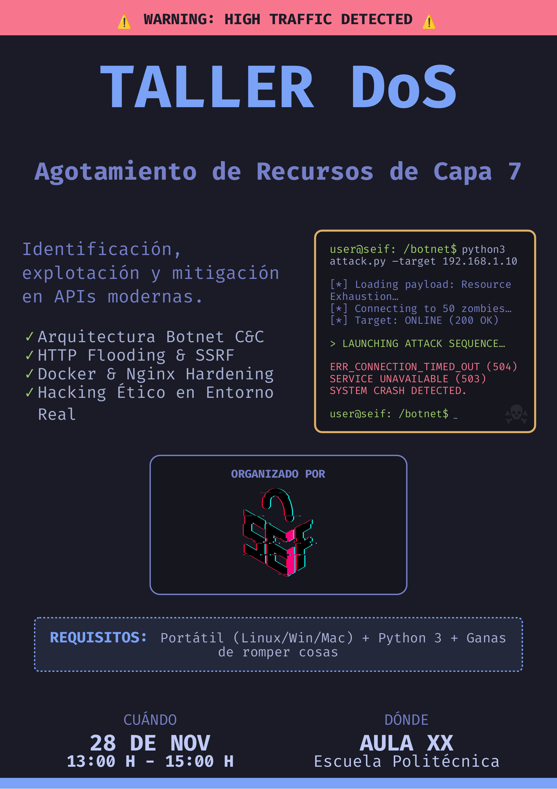

# L7 DoS Workshop Resources

This repository contains the infrastructure and tools for the Layer 7 Denial of Service workshop.



## Network Topology

The three actors, Attacker, Zombie and Server must all be connected to the same local network. The network must be secure and disconnected from the internet

```
--------------         ---------------          ---------------
|Attacker    |---------| Router      |----------| Server      |
|192.168.1.X |         | 192.168.1.1 |          | 192.168.1.Y |
--------------         ---------------          ---------------
                             |
                             |
                       ----------------
                       | Zombie       |
                       | 192.168.1.Z  |
                       ----------------
```

## Server Topology

The server operates with an NGinX proxy, and uses netdata to monitor requests, RAM, CPU, etc. It can be interesting to tinker with the NGinX configuration as to showcase DDoS mitigation.

```
External connection
   |
   |
   |
-----------
| Kernel  | <- Any attack less than L6 would affect it.
-----------
   |
-----------------
   |   DOCKER (labnet)
   |
   |<-------------------------------|
-----------                         |  ------------
| NGINX   |  -> Logs & ratelimits   |->| netdata  | <- Shows resource availability
-----------                         |  ------------
   |                            ----------------
   |                            |   |  Bare metal
-----------                     |  ------------
| Flask   |  <- Affected by L7  |  | SSH      | <- Remote shell
-----------                     |  ------------
```

## Project Structure

### 1. Target Infrastructure (`/app`, `/nginx`)

The victim environment. A vulnerable RESTful Flask API served via Gunicorn and proxied by Nginx.

  * **`app/`**: Main application container.
      * `app.py`: The vulnerable Flask REST API (Endpoints: `/pi`, `/allocations`, `/monitor`).
      * `Dockerfile`: Deployment logic for the victim service.
      * `requirements.txt`: Python dependencies.
  * **`nginx/`**: Reverse proxy configuration.
      * `nginx.conf`: Critical configuration containing caching rules and rate-limiting policies (or lack thereof).
      * `log/`: Access and error logs for real-time monitoring/forensics.
  * **`docker-compose.yml`**: Orchestration file to spin up the Target (Flask + Nginx + Netdata).

### 2. Basic Botnet (`/bot`)

Software for a server with easy code injection

  * **`bot/`**: To be run in the controllable server
      * `app.py`: **Injectable server**. Code to run on the vulnerable bot. 
      * `docker-compose.yml`: Builds and starts the server in a docker.

### 3. Resources (`/nginx/static`)

Resources for the attendees to be able to coordinate the attack.

  * **`nginx/static`**: Downloadable resources for attendees. Nginx will serve this folder 
      * [`presentacion.pdf`](nginx/static/presentacion.pdf): **Slideshow in Spanish**. Contains some information on DoS and HTTP.
      * `presentacion.typ`: To compile the Slideshow with Typst.
      * `cnc.py`: **Master Server**. The script run to control their bots. Accepts connections from bots and starts the attack.
      * `bot.py`: **Payload/Zombie**. The script to be "injected" or run on zombie machines. Connects to C&C and awaits attack orders.
      * `fuzzer.py`: **Fuzzer**. Python script that receives a URL and a wordlist and looks for endpoints.
      * `wordlist.txt`: **Wordlist**. Wordlist for discovering vulnerable endpoints.

## Quick Start

### Setting up the Victim (Instructor/Host)

```bash
docker compose up --build -d
# Metrics available at http://localhost:19999
# Service available at http://localhost:80
```

### Setting up the Potential Zombie

In another device in the same network:

```bash
cd bot
docker compose up --build -d
# Service available at http://localhost:80
```

## Disclaimer

This code is for educational purposes only. It is meant to be run withing a controlled, secure enviroment
